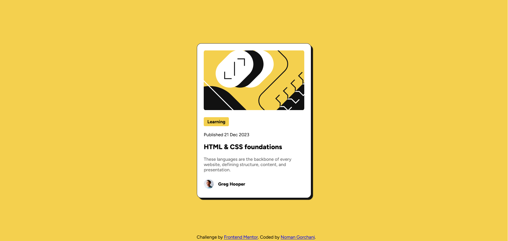

# Frontend Mentor - Blog Preview Card Solution

This is my solution to the [Blog Preview Card challenge](https://www.frontendmentor.io/challenges/blog-preview-card-ckPaj01IcS) on Frontend Mentor.  
The purpose of this project was to practice building a responsive card component using HTML and CSS.

## Overview

### The challenge

Users should be able to:

- View the card layout on different screen sizes
- See hover and focus states for interactive elements

### Screenshot



### Links

- Live Site URL: https://nomanalibaloch.github.io/Blog-Preview-Card/

## Built with

- Semantic HTML5 markup
- CSS custom properties
- Flexbox
- Mobile-first workflow
- Responsive design techniques

## What I learned

While building this project, I practiced:

- Creating responsive layouts
- Using Flexbox for alignment
- Working with custom fonts
- Applying shadows and border radius
- Writing cleaner CSS structure

Example CSS used for responsive images:

```css
.card img{
    width: 100%;
    border-radius: 0.5em;
}
```

## Continued development

In future projects, I want to continue improving my:

- Responsive design skills
- CSS positioning
- Accessibility practices
- UI spacing and consistency

## Author

- GitHub - [Noman Gorchani](https://github.com/)
- Frontend Mentor - [nomanalibaloch](https://www.frontendmentor.io/profile/nomanalibaloch)
